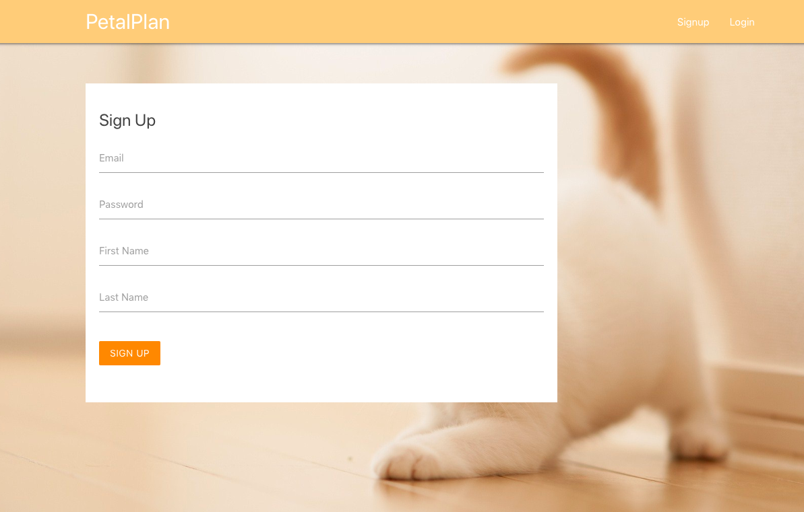
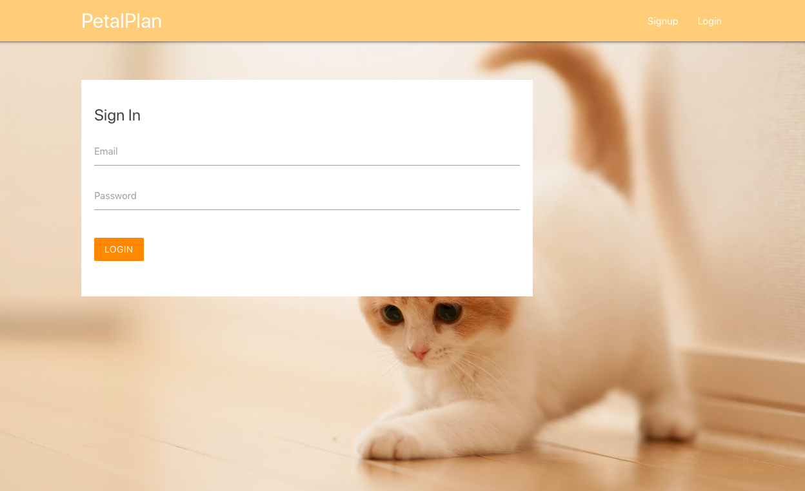
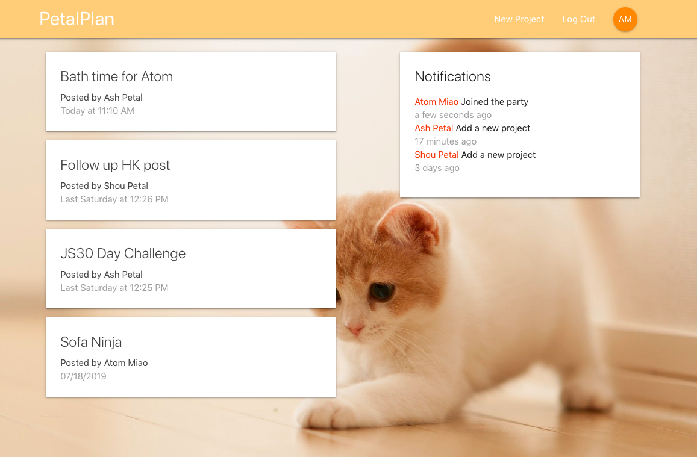
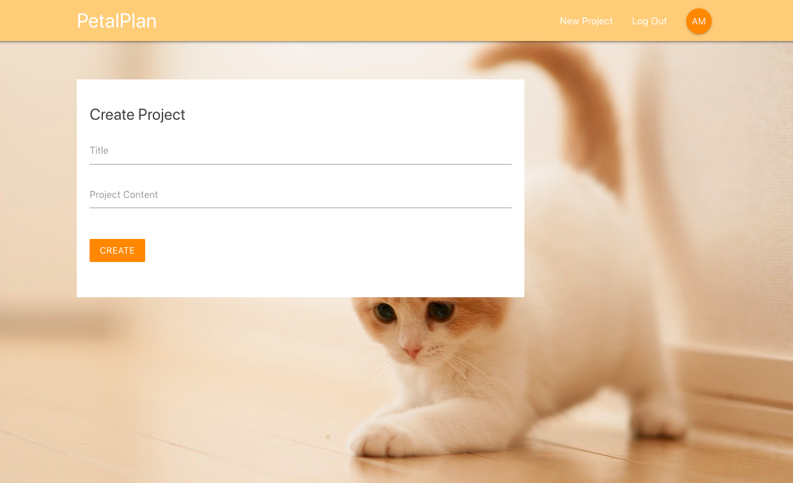

This project was created with React, Redux, and Firebase.

PetalPlan is a web application for teams to post and share their projects. It allows multiple users to sign up, create projects, and see notifications of recent updates on the team.

Online website: https://net-petalplan.web.app/

### User Story  
- Allows multiple users to sign up
- After signed in, users can see all the project summaries
- After signed in, users can also see recent updates on the website, e.g. someone create a new project, someone signed up
- After signed in, users can create projects

### Screenshots

Sign up page

Sign in page

Dashboard

